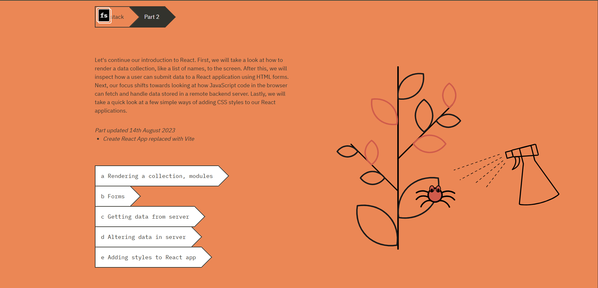
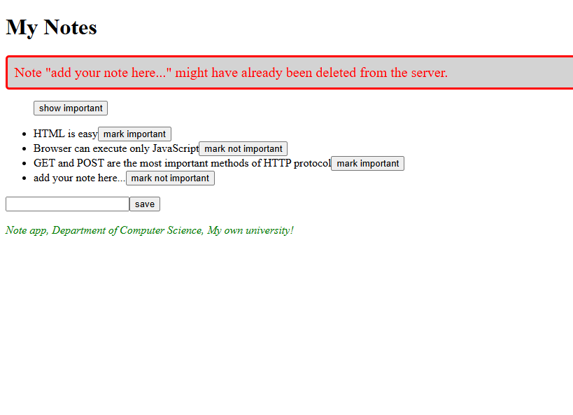

# Part 2: Communicating with Server  

This is an example of a **React Learning Module** from the [Full Stack Open](https://fullstackopen.com/en) course.

In this part of the course, we built a solid understanding of how React applications interact with servers and how data flows between the frontend and backend. The exercises and notes made here were completed as part of the **learning journey** and will serve as both a teaching resource and a submission for exercises.  

// Comments are included in all the code files to ensure readability and to make it easier for anyone to understand the logic and implementation.

## Topics Covered

This part includes the following topics:  

### 1. Rendering a Collection, Modules  
- Learned how to **render lists** and collections of data dynamically in React.  
- Explored the use of **JavaScript array methods** like `.map()` to display lists of names or other data on the screen.  
- Modularized the application by splitting functionality into separate **components** for better readability and maintainability.  

### 2. Forms  
- Implemented **HTML forms** in React to allow users to submit data to the application.  
- Used **state** to handle form inputs and manage the application’s response dynamically.  

### 3. Getting Data from the Server  
- Learned how to **fetch data from a remote backend server** using `axios`.  
- Practiced handling asynchronous operations and updating the React component state based on the fetched data.  

### 4. Altering Data in the Server  
- Explored how to **modify backend data** by sending POST, PUT, and DELETE requests from the React application using `axios`.  
- Implemented features such as adding, updating, and removing data directly from the server.  

### 5. Adding Styles to React App  
- Added simple CSS styles to improve the appearance of React applications.  
- Explored various ways to include styles, such as inline styling, CSS files, and CSS modules.  

## Glimpse of the Note Application

Here is a preview of some of the concepts applied during this part:  

## New Concepts Learnt  

This part introduced several **key concepts** of full-stack development:  
- **Rendering dynamic content:** Leveraging React's rendering features to display lists or collections based on real-time data.  
- **Interacting with backend servers:** Fetching, adding, updating, and deleting data stored in a remote server.  
- **Managing application state:** Using React state effectively to control user inputs, data fetched from servers, and rendered components.  
- **Applying styles to React components:** Enhancing the UI with CSS techniques to make the applications more visually appealing.  

The course emphasizes the challenges of full-stack development and the importance of approaching these challenges systematically. As stated in the course:  

> The complexity of our app is now increasing since besides just taking care of the React components in the frontend, we also have a backend that is persisting the application data.  
> Full stack development is extremely hard  

## Full Stack Development Oath  

To help overcome these challenges, the course provides the **Full Stack Development Oath**:  

> - I will use all the possible means to make it easier  
> - I will have my browser developer console open all the time  
> - I will use the network tab of the browser dev tools to ensure that frontend and backend are communicating as I expect  
> - I will constantly keep an eye on the state of the server to make sure that the data sent there by the frontend is saved there as I expect  
> - I will progress with small steps  
> - I will write lots of console.log statements to make sure I understand how the code behaves and to help pinpoint problems  
> - If my code does not work, I will not write more code. Instead, I start deleting the code until it works or just return to a state when everything was still working  
> - When I ask for help in the course Discord channel or elsewhere I formulate my questions properly, see [here](https://fullstackopen.com/en/part0/general_info#how-to-get-help-in-discord) how to ask for help  

## Contact  

If you have any questions or encounter any issues while reviewing this repository, feel free to reach out to me.  
**Hyvä Jouluä!**
