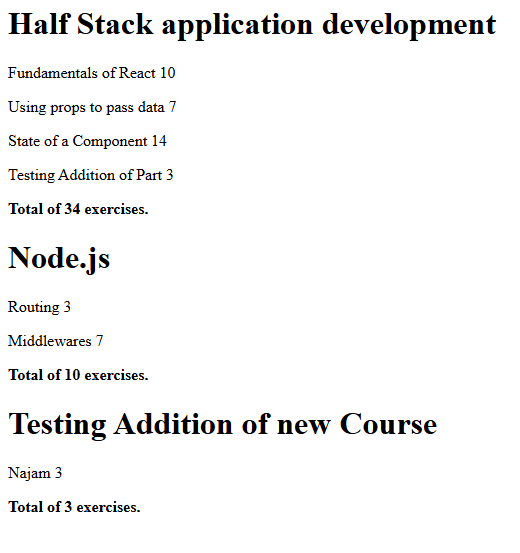

# Course Information


This is an example of **React Application**.

- We created a flexible web application that helps us **view all of our courses** as well as the sections, parts and topics it includes. We can include the amount of exercises as well.


- It is flexible in the sense that we can **add more to the content**. Here is a glimpse to the application:<br/>



```

// I have added as many comments to the codes so that I can make it easy for everybody to understand.

```

## New Concepts Learnt


We were able to learn and apply the new concept of getting data from backend server and manioulating stored course information directly.
- Setting up a server is quite complex when we do it for the first but we get a good grip after that. The course itself says:
> The complexity of our app is now increasing since besides just taking care of the React components in the frontend, we also have a backend that is persisting the application data.
> Full stack development is extremely hard

To cope with all these challenges, the course has this **Full Stack Development Oath**:

>  - I will use all the possible means to make it easier
>  - I will have my browser developer console open all the time
>  - I will use the network tab of the browser dev tools to ensure that frontend and backend are communicating as I expect
>  - I will constantly keep an eye on the state of the server to make sure that the data sent there by the frontend is saved there as I expect
>  - I will progress with small steps
>  - I will write lots of console.log statements to make sure I understand how the code behaves and to help pinpoint problems
>  - If my code does not work, I will not write more code. Instead, I start deleting the code until it works or just return to a state when everything was still working
>  - When I ask for help in the course Discord channel or elsewhere I formulate my questions properly, see [here](https://fullstackopen.com/en/part0/general_info#how-to-get-help-in-discord) how to ask for help


**Please feel free to get in touch with me in case you find any trouble or confusions.**
**Hyvä Jouluä**