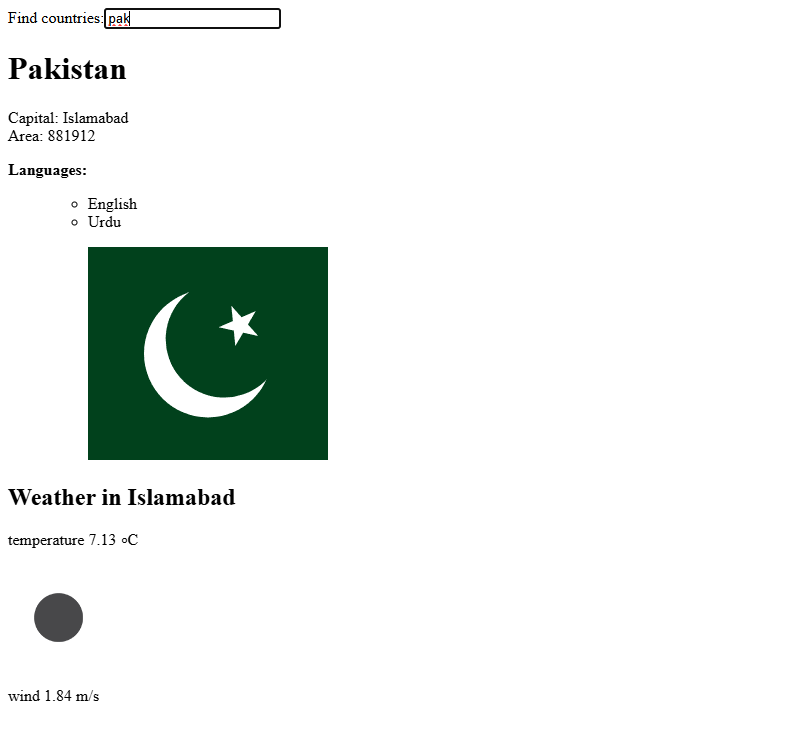

# Data for Countries  

This is an example of a **React Application**.  

- This application allows us to **search for any country** and get detailed information such as:  
  - **Capital**  
  - **Area**  
  - **Languages** spoken  
  - The **Flag**  
  - Current **Weather**  

- It is a flexible and dynamic application as it fetches live weather data and other details using external APIs. Here is a glimpse of the application:  

  

// I've added comments throughout the code to ensure anyone can easily follow the logic and functionality.

## New Concepts Learnt  

While building this project, we learned and applied **new concepts** such as:  
- **Using API keys** securely for accessing external services like OpenWeatherMap.  
- Fetching data dynamically with **Axios** to interact with external APIs.  

The course emphasized how to overcome challenges, especially when dealing with APIs and asynchronous requests. As the course itself says:  

> The complexity of our app is now increasing since besides just taking care of the React components in the frontend, we also have a backend that is persisting the application data.  
> Full stack development is extremely hard  

To navigate these challenges, the course provides a **Full Stack Development Oath**:  

> - I will use all the possible means to make it easier  
> - I will have my browser developer console open all the time  
> - I will use the network tab of the browser dev tools to ensure that frontend and backend are communicating as I expect  
> - I will constantly keep an eye on the state of the server to make sure that the data sent there by the frontend is saved there as I expect  
> - I will progress with small steps  
> - I will write lots of console.log statements to make sure I understand how the code behaves and to help pinpoint problems  
> - If my code does not work, I will not write more code. Instead, I start deleting the code until it works or just return to a state when everything was still working  
> - When I ask for help in the course Discord channel or elsewhere I formulate my questions properly, see [here](https://fullstackopen.com/en/part0/general_info#how-to-get-help-in-discord) how to ask for help  

**Please feel free to get in touch with me in case you have any trouble or confusion.**  
**Hyvä Jouluä!**
