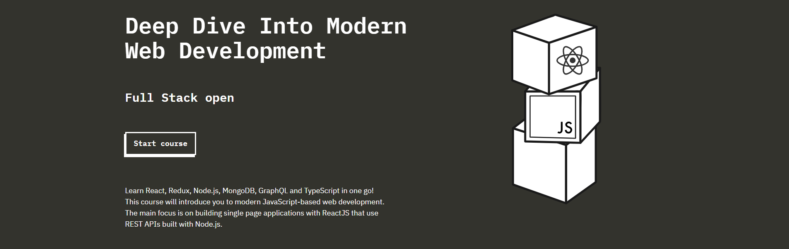

# Deep Dive Into Modern Web Development  

  

This repository contains all my solutions, exercises, and notes from the **ULTIMATE Full Stack Development Course**: **Deep Dive into Modern Web Development**
**[Full Stack Open](https://fullstackopen.com/en)**, provided by the University of Helsinki.  

The course is designed to introduce you to **modern web development** with JavaScript-based technologies. From building interactive **Single Page Applications (SPA)** with React to creating robust backends with Node.js, this course covers it all.  

> “Learn React, Redux, Node.js, MongoDB, GraphQL, and TypeScript in one go!”  

---

## 📚 **Course Overview**  

The course focuses on **modern web development practices**, including:  
- Building scalable **single-page applications** with **ReactJS**.  
- Interacting with **REST APIs** and learning **GraphQL** for efficient data handling.  
- Creating **backends with Node.js** and storing data using **MongoDB**.  
- Understanding state management with **Redux**.  
- Exploring **TypeScript** for better code maintainability.  

This course is worth **14 ECTS credits**, with an additional **10 credits** for the final project, making a total of **24 ECTS credits**.  

---

## 📂 **Repository Structure**  

Each folder in this repository corresponds to a **specific part** of the course:  

| Part | Description | Key Topics |
|------|-------------|------------|
| **Part 0** | Fundamentals of Web Apps | Web architecture, HTTP, HTML, CSS |
| **Part 1** | Introduction to React | Components, JSX, state, props |
| **Part 2** | Communicating with the Server | Forms, fetching data, styling |
| **Part 3** | Programming a Server with Node.js | Express, REST APIs, middleware |
| **Part 4** | Testing Express Servers | Unit testing, integration testing |
| **Part 5** | Testing React Apps | End-to-end testing, CI/CD pipelines |
| **Part 6** | Advanced State Management | Redux, reducers, actions |
| **Part 7** | React Router & GraphQL | Routing, queries, mutations |
| **Part 8** | Backend Integration with TypeScript | Type safety, advanced Node.js |
| **Final Project** | Comprehensive Full Stack Project | SPA with a backend and database |

Each part includes exercises, explanations, and notes in its own folder to keep things organized.  

---

## 🚀 **Technologies Covered**  

Here’s a list of the main technologies explored throughout this course:  
- **Frontend:** React, Redux, CSS, HTML  
- **Backend:** Node.js, Express, MongoDB  
- **State Management:** Redux, Context API  
- **Database:** MongoDB, Mongoose  
- **API Interaction:** REST APIs, GraphQL  
- **Tooling:** Git, Jest, Webpack, Babel  
- **Language Features:** JavaScript (ES6+), TypeScript  

---

## 💡 **What You’ll Learn**  

This course offers an in-depth understanding of full stack development:  
- Building responsive and dynamic **frontend applications** with React.  
- Designing and implementing **backend services** with Node.js and Express.  
- Persisting data in **NoSQL databases** like MongoDB.  
- Writing **clean and testable code** using unit and integration testing.  
- Managing complex application state with **Redux** and Context API.  
- Adding **dynamic typing** to JavaScript projects using TypeScript.  

---

## 🌟 **How to Navigate This Repository**  

- Each folder corresponds to a **specific part** of the course.  
- Inside each folder, you'll find:  
  - **Exercises:** Solutions to all assigned tasks.  
  - **README.md Files:** A general explanation of what was learnt and what the application is about.  
> **NB:** Detailed comments have been added to all the code to make the code easy to understand.  
- Start from **Part 0** and move sequentially to grasp the concepts step by step.  

---

## 🖼️ **Course in Action**  

Here are a few examples of the applications built during the course:  

### 🌍 Countries Application  
Search for a country to view its details, including capital, area, flag, and weather.  
  
Access it [here](https://github.com/Najam-Hassan-Kazmi/Deep-Dive-Into-Modern-Web-Development/tree/5028a20085cba9f72cf8863a5281087241378838/Part%202/data-for-countries)

### 📞 Phonebook Application  
Add, search, and manage contacts with server-side integration.  

Access it [here](https://github.com/Najam-Hassan-Kazmi/Deep-Dive-Into-Modern-Web-Development/tree/5028a20085cba9f72cf8863a5281087241378838/Part%202/phonebook)

### 📖 Notes Application  
A CRUD app for managing notes.  

### 🛒 Final Project
A comprehensive full-stack SPA with advanced features. __As this course is being worked on right now. Hence the final project has not been completed yet. It will be added as soon as it gets completed.__
<!--    -->
<!-- Link: ![] -->

---

## 🎓 **Final Words**  

Let’s dive into the **world of modern web development** and create amazing applications while learning the best practices. This journey is packed with fun exercises, challenges, and invaluable lessons.  

Feel free to explore the repository and reach out if you have any questions!  

**Happy Coding! 😊**  
**Iloista Koodailua!**
